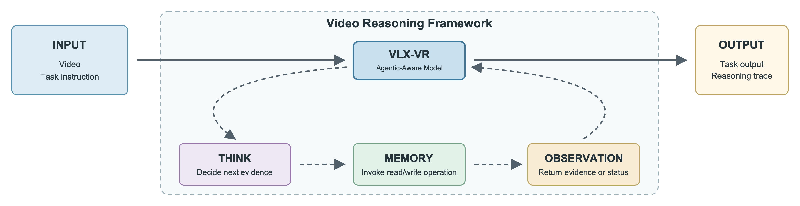
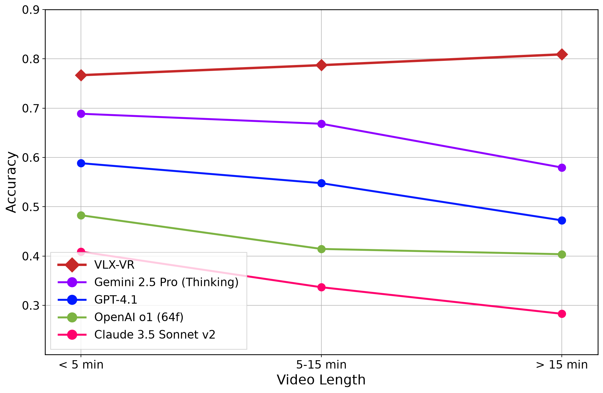
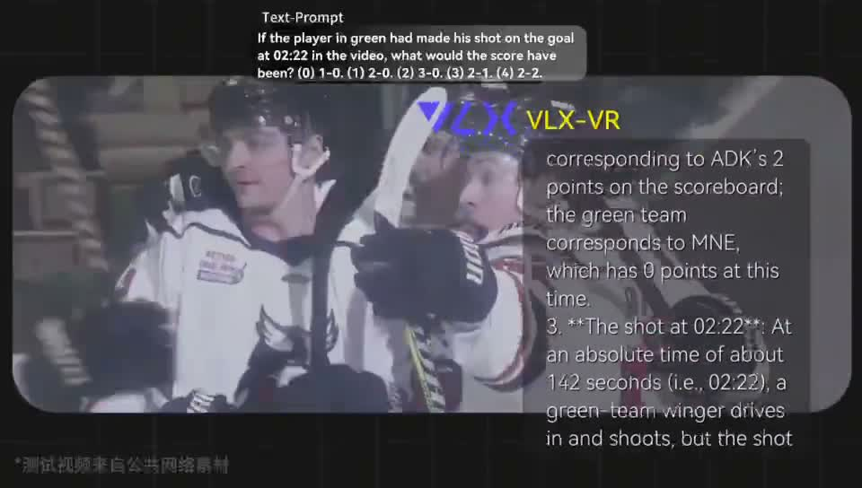
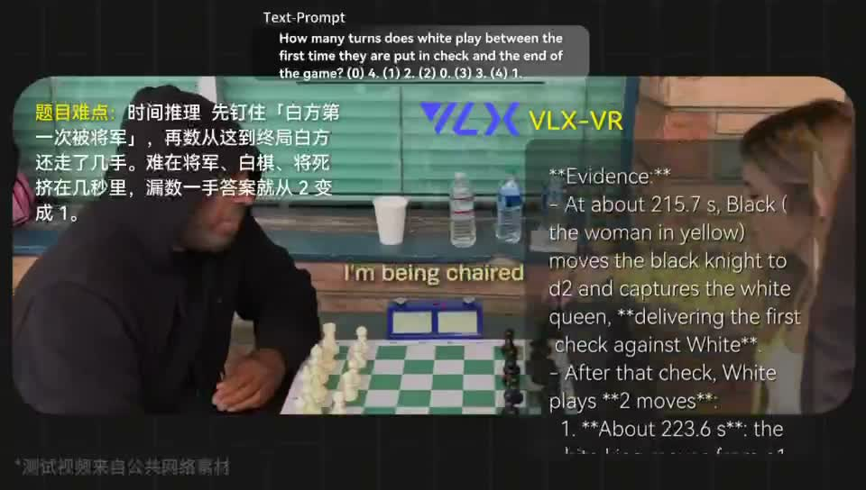
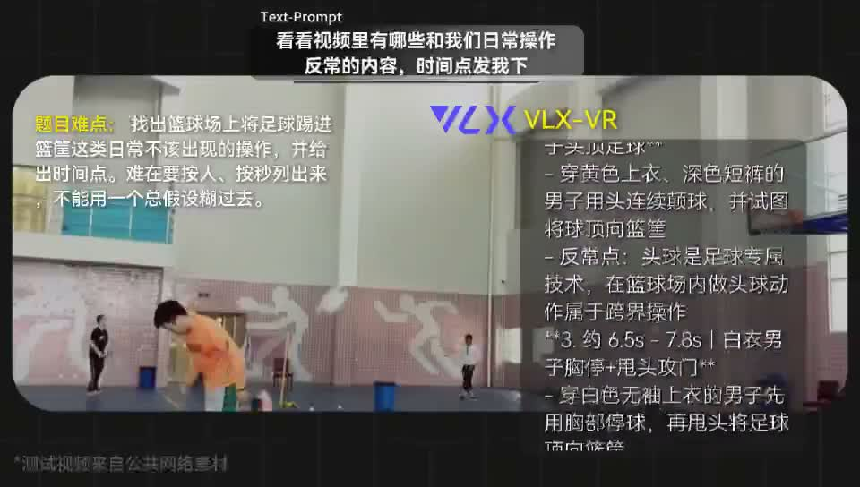

<p align="center">
  
</p>

<h1 align="center">VLX-VR</h1>

<h3 align="center">面向 Agentic 的视频推理模型</h3>

<p align="center">
  <a href="README.md">English</a> | 中文
</p>

<p align="center">
  <a href="https://x.com/OmAI_lab">
    
  </a>
  <a href="https://www.youtube.com/@OmAILab_global">
    
  </a>
  <a href="https://discord.gg/SEVNjyXPef">
    
  </a>
  <br>
  <a href="https://arxiv.org/abs/2609.09985">
    
  </a>
  <a href="https://www.youtube.com/watch?v=paqyRLzPcbw">
    
  </a>
  <a href="https://om-agent.cn/">
    
  </a>
</p>

<p align="center"><sub>介绍视频：VLX-VR 面向 agentic-aware 视频推理</sub></p>

<p align="center">
  <a href="https://www.youtube.com/watch?v=paqyRLzPcbw">
    
  </a>
</p>

<p align="center">📺 高清版本：<a href="https://www.youtube.com/watch?v=paqyRLzPcbw">在 YouTube 观看</a></p>

**VLX-VR** 是一个面向 agentic 的视频推理模型，在 **Think–Memory–Observation** 循环定义的视频推理框架中训练。它面向真实世界视频分析：视觉、音频、文本和时间证据分散在短视频与长视频中，固定上下文、单次推理的 VideoQA 往往不够用。

不同于在推理开始前就锁死视频上下文，VLX-VR 学习判断还需要什么证据，调用 `read_memory` 或 `write_memory`，吸收返回的 Observation，再决定继续取证还是产出最终结果。

> [!TIP]
>
> **🚀 立即体验 [VLX](https://om-agent.cn/)**，探索 Om AI 模型如何理解、推理并与多模态世界交互。

## 社区

加入 VLX 社区，与开发者交流、探索应用、分享反馈，并共同塑造多模态 AI 的未来。

<table align="center">
  <thead>
    <tr>
      <th><div align="center">官方微信</div></th>
      <th><div align="center">Discord 社区</div></th>
    </tr>
  </thead>
  <tbody>
    <tr>
      <td align="center">
        
      </td>
      <td align="center">
        <a href="https://discord.gg/SEVNjyXPef">
          
        </a>
      </td>
    </tr>
  </tbody>
</table>

如需技术支持、商务合作或社区咨询，请通过 **[marketing@hzlh.com](mailto:marketing@hzlh.com)** 与我们联系。

## 更新

- **[2026-09-22]** 🔥🔥🔥 GitHub 上架包发布：README（中/英）、介绍素材与 notebook。
- **[2026-09]** 论文发布：[VLX-VR: An Agentic-Aware Video Reasoning Model](https://arxiv.org/abs/2609.09985)（`arXiv:2609.09985`）。
- **[2026-09]** 介绍视频上线：[在 YouTube 观看](https://www.youtube.com/watch?v=paqyRLzPcbw)。

## 项目概览

<p align="center">
  
</p>

<p align="center"><em>图 1. 用于训练与运行 VLX-VR 的 Think–Memory–Observation 框架循环。</em></p>

现代视频大模型已经擅长描述片段，并在固定采样上下文上回答视觉问答。真实事件分析更难：

- **自适应取证：** 在初次观察后回看更早时刻、补齐缺失线索，或处理冲突信息。
- **多模态 grounding：** 同时利用画面、音频、OCR/字幕与时间戳，而不是只靠单一模态。
- **状态保持：** 在多步推理中维护中间假设与观察结果。
- **终止控制：** 证据足够时停止，而不是无限循环或过早作答。

许多流水线仍遵循：

```text
视频 + 问题 -> 固定采样上下文 -> 单次推理答案
```

VLX-VR 把任务改写为：

```text
视频 + 指令 -> Think -> Memory(读/写) -> Observation -> 继续或作答
```

这样，证据获取、记忆使用与终止决策成为模型学到的推理策略，而不只是外部 prompt 包装。

## 核心亮点

- **Agentic-aware 视频推理：** 在 Think–Memory–Observation 循环内训练，而不是只把通用 VLM 塞进外部 Agent 控制器。
- **直接多模态记忆访问：** Memory 提供 `read_memory` / `write_memory`；VLX-VR 根据当前推理状态选择操作。
- **MINERVA 强结果：** 在本次对照模型中达到 **78.79%** 准确率。
- **时长稳健：** 在 MINERVA 原三档时长下为 **76.70% / 78.73% / 80.92%**；CDAV = **2.97 pp²**。
- **过程可核：** 答对样本上，**96.20%** 的推理轨迹与 MINERVA 参考轨迹及其证据一致；约 **75.80%** 样本同时满足答对与证据一致。

## 问题设定

人们理解视频时会定位关键时段、比较事件前后状态、阅读场景文字，并把语音内容与画面动作关联起来。支持这类推理，需要的不只是识别物体或孤立帧。

在许多标准 VideoQA 流水线中，Video-LLaVA、Qwen3-VL、VideoLLaMA 3 等模型把采样帧或片段当作固定输入，并在单次推理中产出结果。由于证据在推理开始前就已确定，模型无法在发现缺失、模糊或冲突信息后再自适应取证。

现有视频 Agent 通过迭代收集、时间定位与记忆查询更接近真实需求。但如果只是把通用 VLM 放进外部循环、却没有针对该角色训练，仍可能失败：模型可能重复取证、丢掉中间状态，或过早终止。

VLX-VR 关注的核心问题是：

> 能否训练一个视频推理模型，使其不只是参与 agentic 流水线，而是把证据获取、记忆使用与终止决策学成推理过程的一部分？

VLX-VR 的答案是：

> 在带直接多模态记忆访问的 Think–Memory–Observation 循环中，训练 agentic-aware 模型。

## Think–Memory–Observation 循环

在推理步 *t*，VLX-VR 维护状态 *s<sub>t</sub>*，包含任务指令、已观察证据、记忆中的多模态内容、当前输出假设与未解决不确定性。

循环包含三阶段：

1. **Think：** 理解任务目标，提出下一步证据需求，并估计当前证据是否足够。
2. **Memory：** 调用 `read_memory` 或 `write_memory`，检索多模态证据或保留中间状态。
3. **Observation：** 把 Memory 操作结果返回给 VLX-VR，供下一步决策。

证据足够时，VLX-VR 产出带支持证据的最终结果；证据不足或冲突时，回到 Think，再开一轮 Memory。

```text
s_0 = initialize(video, instruction)
while not stop(s_t):
    think_t, call_t = VLX-VR(s_t)
    obs_t = execute(call_t)          # call_t ∈ {read_memory, write_memory}
    s_{t+1} = update(s_t, obs_t)
output = VLX-VR(s_t)
```

多模态记忆是外部、可检查的推理状态，而不仅是文本摘要缓存。视频、音频、支持证据、Observation 与中间状态可跨步读写、记录与复用。

## 评测：MINERVA

我们主要在 [MINERVA](https://arxiv.org/abs/2505.00681) 上评测，因为它同时具备较广的时长覆盖与人工标注推理轨迹。每道题包含视频、问题、五个选项与参考推理轨迹，适合同时评估答案准确率与证据落地的过程质量。

### 总体准确率

| 模型 | 准确率 (%) | 相对 VLX-VR (pp) | 来源 |
| --- | ---: | ---: | --- |
| **VLX-VR** | **78.79** | — | [本工作](https://arxiv.org/abs/2609.09985) |
| Seed2.1 Pro | 70.70 | -8.09 | [Seed2.1](https://seed.bytedance.com/en/seed2_1) |
| Gemini 3.5 Flash | 68.60 | -10.19 | [Seed2.1](https://seed.bytedance.com/en/seed2_1) |
| Gemini 2.5 Pro Thinking | 66.20 | -12.59 | [MINERVA](https://arxiv.org/abs/2505.00681) |
| Seed2.1 Turbo | 65.90 | -12.89 | [Seed2.1](https://seed.bytedance.com/en/seed2_1) |
| Gemini 3.1 Pro | 63.50 | -15.29 | [Seed2.1](https://seed.bytedance.com/en/seed2_1) |
| GPT-4.1 | 53.99 | -24.80 | [MINERVA](https://arxiv.org/abs/2505.00681) |
| GPT-4o | 45.54 | -33.25 | [MINERVA](https://arxiv.org/abs/2505.00681) |
| OpenAI o1 | 43.48 | -35.31 | [MINERVA](https://arxiv.org/abs/2505.00681) |
| Claude 3.5 Sonnet v2 | 31.28 | -47.51 | [MINERVA](https://arxiv.org/abs/2505.00681) |
| Human | 92.54 | +13.75 | [MINERVA](https://arxiv.org/abs/2505.00681) |
| Random | 20.00 | -58.79 | [MINERVA](https://arxiv.org/abs/2505.00681) |

### 按时长准确率

<p align="center">
  
</p>

<p align="center"><em>图 2. MINERVA 时长分档准确率。在原三档划分下，VLX-VR 随时长拉长仍保持强结果。</em></p>

| 模型 | 5 分钟以下 | 5–15 分钟 | 15 分钟以上 |
| --- | ---: | ---: | ---: |
| **VLX-VR** | **76.70** | **78.73** | **80.92** |
| Gemini 2.5 Pro Thinking | 68.87 | 66.84 | 57.97 |
| GPT-4.1 | 58.84 | 54.79 | 47.25 |
| OpenAI o1 | 48.28 | 41.45 | 40.38 |
| Claude 3.5 Sonnet v2 | 40.90 | 33.68 | 28.30 |

在 MINERVA 原三档下，VLX-VR 均值准确率 **78.78%**，CDAV **2.97 pp²**，标准差 **1.72 pp**，极差 **4.22 pp**。公开基线随时长下滑；在该划分下 VLX-VR 不跟着掉。

对长视频档做更细切分后可见：原「15 分钟以上」结果主要由 **15–30 分钟（83.40%）** 拉动，**30 分钟以上** 为 **74.75%**。整体仍大致稳健，并未在更长视频上崩溃。

### 技能剖面

| 技能 | 准确率 (%) |
| --- | ---: |
| 阅读理解 | 90.76 |
| 情境感知 | 90.32 |
| 时间推理 | 85.95 |
| 数值推理 | 85.71 |
| 事件发生 | 82.81 |
| 物体识别 | 82.01 |
| 目标推理 | 76.92 |
| 听力 | 75.19 |
| 反事实推理 | 74.19 |
| 空间感知 | 73.47 |
| 因果关系 | 72.73 |
| 状态变化 | 69.23 |
| 计数 | 66.67 |

VLX-VR 在阅读、情境感知、时间推理与数值推理上更强；计数、状态变化、因果推理与空间感知仍有挑战。

### 参考轨迹一致性

在答对样本上，**96.20%** 的 VLX-VR 推理轨迹与 MINERVA 参考轨迹及其证据描述一致。全量上：

**78.79% × 96.20% ≈ 75.80%**

样本同时满足答对与证据一致。该联合口径仍高于 Seed2.1 Pro 的仅答案准确率（70.70%），但两者成功标准并不相同。

## 案例演示

以下三则是 **VLX-VR** 与 **Gemini 3.1 Pro** 的真实对比情况：同一用户提示、同一公共网络素材，并排看两边如何落地证据、时间戳与最终答案。

<table>
  <tr>
    <td width="33%" align="center" valign="top">
      <a href="assets/demos/case1-hockey-score.mp4">
        
      </a>
      <br>
      <b>案例 1 · 反事实比分</b><br>
      <sub>冰球：若绿衣球员在 02:22 打进，比分会是多少？</sub><br>
      <a href="assets/demos/case1-hockey-score.mp4">▶️ 观看 MP4</a>
    </td>
    <td width="33%" align="center" valign="top">
      <a href="assets/demos/case2-chess-check-turns.mp4">
        
      </a>
      <br>
      <b>案例 2 · 时间计数</b><br>
      <sub>象棋：白方首次被将军到终局之间走了几手？</sub><br>
      <a href="assets/demos/case2-chess-check-turns.mp4">▶️ 观看 MP4</a>
    </td>
    <td width="33%" align="center" valign="top">
      <a href="assets/demos/case3-basketball-anomaly.mp4">
        
      </a>
      <br>
      <b>案例 3 · 异常 + 时间点</b><br>
      <sub>场馆：找出篮球场上反常操作，并按秒列出时间点。</sub><br>
      <a href="assets/demos/case3-basketball-anomaly.mp4">▶️ 观看 MP4</a>
    </td>
  </tr>
</table>

<details>
<summary><b>每则案例看点</b></summary>

- **案例 1（冰球 / 反事实）：** 两边都可能选对选项，但 VLX-VR 保留证据链（记分牌 OCR → 队服与队名绑定 → 02:22 射门 → 假设进球后 2-1）。Gemini 3.1 Pro 常压成一句正确结论，不写清队名/队服如何确认。
- **案例 2（象棋 / 时间推理）：** VLX-VR 对齐时间戳点明白方被将军后的两手（约 215.7s 首将军 → 223.6s / 228.1s 白方两手 → 229.7s 将杀）。漏一手就会把选择题从 2 改成 1；Gemini 3.1 Pro 易漏中间一手。
- **案例 3（篮球场 / 异常检测）：** 难在按人、按秒列出「篮球场踢足球进筐」这类跨界操作，而不是编一个全局故事（如「整片倒放」）。VLX-VR 给出可核对区间；Gemini 3.1 Pro 可能过度承诺错误总假设。

</details>

文件位于 [`assets/demos/`](assets/demos/)。测试视频来自公共网络素材。

## Notebook

见 [`notebooks/vlx_vr.ipynb`](notebooks/vlx_vr.ipynb) — **Coming soon**。

## 开源状态

| 项目 | 状态 |
| --- | --- |
| 论文 | 已发布（[arXiv:2609.09985](https://arxiv.org/abs/2609.09985)） |
| 介绍视频 | 已发布（[YouTube](https://www.youtube.com/watch?v=paqyRLzPcbw)） |
| 案例演示 | 已发布（[assets/demos/](assets/demos/)） |
| README + notebook 包 | 本仓库 |

## 为什么是 VLX-VR

- 相比固定上下文的 VideoQA 模型，VLX-VR 可在推理过程中自适应获取并再评估证据。
- 相比未针对角色训练、只挂在外部 Agent 循环里的通用 VLM，VLX-VR 把取证、记忆与终止学成策略行为。
- 相比只评最终答案的 VideoQA，MINERVA 风格轨迹让我们可以检查「答对」是否也「证据落地」。
- 相比随时长下滑的公开长视频曲线，VLX-VR 在 MINERVA 原三档时长下保持强结果。

## 技术脉络

我们团队长期深耕多模态感知与推理，此前开源了 [OmDet](https://github.com/om-ai-lab/OmDet)、[VLM-R1](https://github.com/om-ai-lab/VLM-R1)、[VLX-Seek](https://github.com/om-ai-lab/VLX-Seek)、[VLX-Flow](https://github.com/om-ai-lab/VLX-Flow)、[VLX-Go](https://github.com/om-ai-lab/VLX-Go) 等工作。VLX-VR 把这条线从感知与流式理解，进一步推进到带显式多模态记忆控制的 agentic-aware 视频推理。

## 引用

```bibtex
@article{vlxvr2026,
  title   = {VLX-VR: An Agentic-Aware Video Reasoning Model},
  author  = {{Om AI Lab}},
  journal = {arXiv preprint arXiv:2609.09985},
  year    = {2026}
}
```

## 许可证

代码与模型权重的许可条款见仓库许可证文件。
